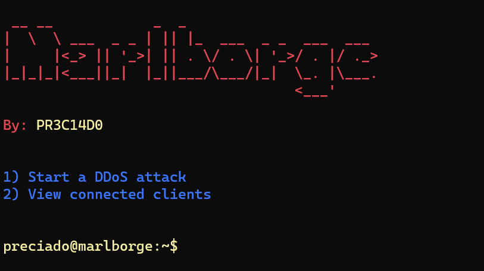

# Marlborge
&nbsp;&nbsp;&nbsp;&nbsp;&nbsp;<kbd></kbd>

- Made only for educational purposes

# Gallery

<b>Marlborge server preview</b>

# Setup
- First <a href="https://dotnet.microsoft.com/en-us/download/dotnet/5.0">Install .NET 5.0</a>
- Install <a href="https://visualstudio.microsoft.com/">Install Visual Studio</a> on your computer
- Then, download the source code of the project and extract on a folder.
- Open Visual Studio and open the solution of `Marlborge Client`. Once, edit the PORT of the socket and the IP Address to connect to your VPS. (If you want localhost, you can to set it on `127.0.0.1`)
- Open the solution of `Marlborge Server` and set the PORT you want to connect de client.
- Compile all and save the server for your VPS and the client for the connection.
- This is only made for educational purposes, but if you want to create a realistic environment, you can code an infection for the client.
- The last step and the most important, have fun!